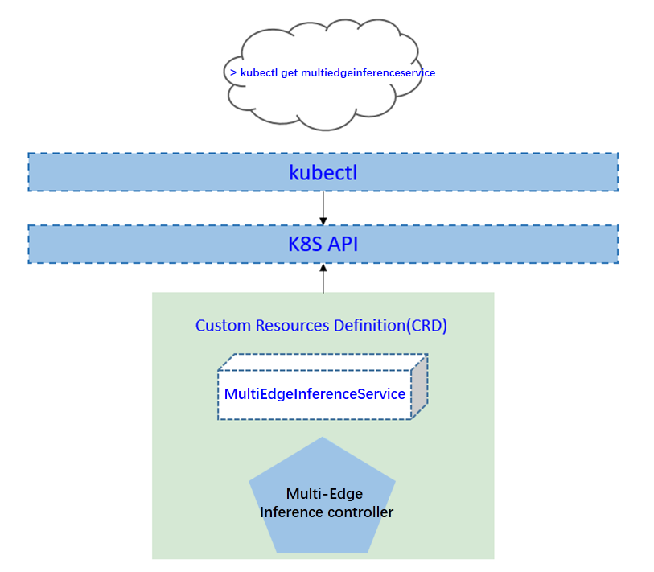
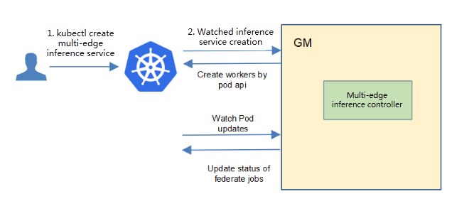
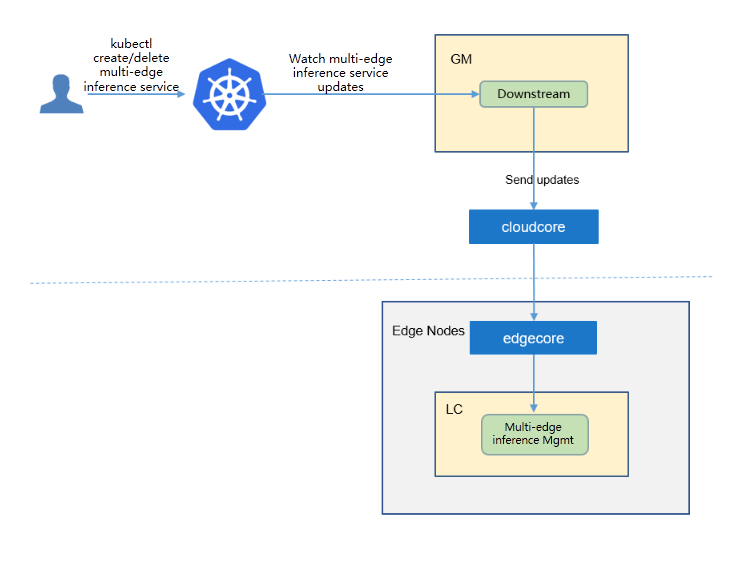
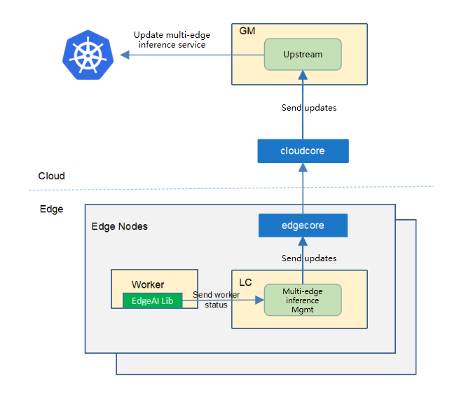
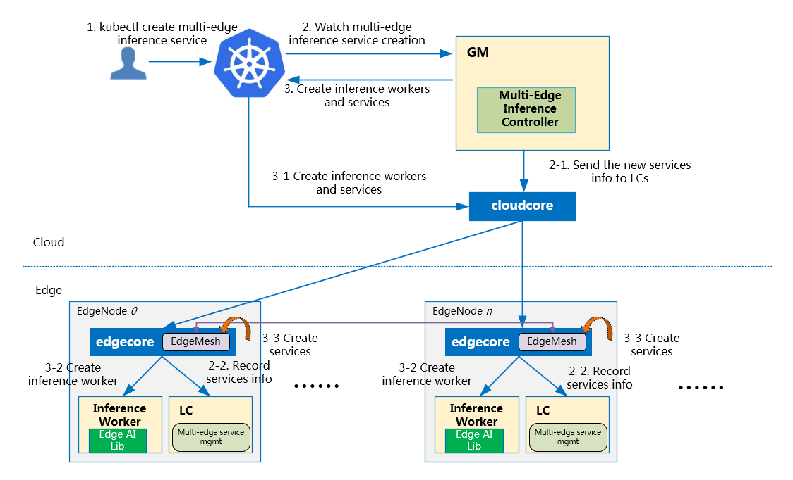
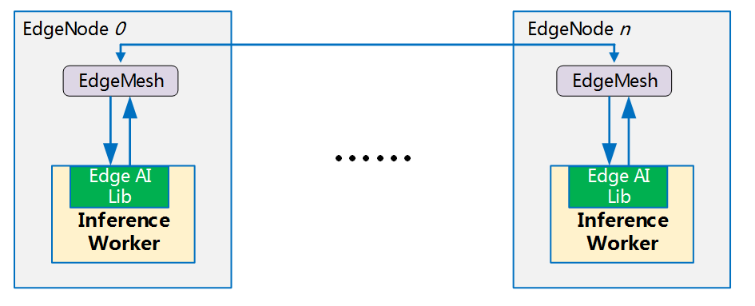

- [Multi-Edge Collaborative Inference](#multi-edge-collaborative-inference)
  - [Motivation](#motivation)
    - [Goals](#goals)
  - [Proposal](#proposal)
    - [Use Cases](#use-cases)
  - [Design Details](#design-details)
    - [CRD API Group and Version](#crd-api-group-and-version)
    - [Multi-edge inference CRD](#multi-edge-inference-crd)
    - [Multi-edge inference type definition](#multi-edge-inference-type-definition)
      - [Validation](#validation)
    - [Multi-edge inference service sample](#multi-edge-inference-service-sample)
  - [Controller Design](#controller-design)
    - [Multi-edge Inference Controller](#multi-edge-inference-controller)
    - [Downstream Controller](#downstream-controller)
    - [Upstream Controller](#upstream-controller)
    - [Details of api between GM(cloud) and LC(edge)](#details-of-api-between-gmcloud-and-lcedge)
    - [Flow of multi-edge inference service creation](#flow-of-multi-edge-inference-service-creation)
  - [Workers Communication](#workers-communication)
# Multi-Edge Collaborative Inference
## Motivation
Multi-edge collaborative inference refers to the use of multiple edge computing nodes for collaborative inference. This technology can make full use of the distributed computing resources of edge computing nodes, reduce the delay of edge AI services and improve inference accuracy and throughput. It is a key technology of edge intelligence Therefore, we propose a multi-edge collaborative inference framework to help users build multi-edge collaborative AI business easily based on KubeEdge.


### Goals
* The framework can utilize multiple edge computing nodes for collaborative inference.
* Provide a variety of multi-edge collaborative inference microservice images for typical application scenarios (such as ReID, multi-source data fusion, etc.).
* Utilize KubeEdge's EdgeMesh to realize multi-edge load balancing.

## Proposal
We propose using Kubernetes Custom Resource Definitions (CRDs) to describe the multi-edge collaborative inference inference specification/status and a controller to synchronize these updates between edge and cloud.


### Use Cases

* User can create typical multi-edge collaborative inference applications (such as ReID, multi-source data fusion, etc.) with providing AI models.
* Users can customize novel multi-edge collaborative inference applications based on our framework.

## Design Details
### CRD API Group and Version
The `MultiEdgeInferenceService` CRD will be namespace-scoped.
The tables below summarize the group, kind and API version details for the CRD.

* MultiEdgeInferenceService

| Field                 | Description             |
|-----------------------|-------------------------|
|Group                  | sedna.io     |
|APIVersion             | v1alpha1                |
|Kind                   | MultiEdgeInferenceService   |

### Multi-edge inference CRD
Below is the CustomResourceDefinition yaml for `MultiEdgeInferenceService`:

[crd source](/build/crds/multiedgeinferenceservice_v1alpha1.yaml)

### Multi-edge inference type definition

[go source](/pkg/apis/sedna/v1alpha1/multiedgeinference_types.go)

#### Validation
[Open API v3 Schema based validation](https://kubernetes.io/docs/tasks/access-kubernetes-api/custom-resources/custom-resource-definitions/#validation) can be used to guard against bad requests.
Invalid values for fields (example string value for a boolean field etc) can be validated using this.

Here is a list of validations we need to support :
1. The `model` specified in the crd should exist in k8s.
2. The edgenode name specified in the crd should exist in k8s.

### Multi-edge inference service sample
See the [source](./crd-samples/multiedgeinferenceservice_v1alpha1.yaml) for an example.

## Controller Design
The multi-edge inference controller starts three separate goroutines called `upstream`, `downstream` and `multi-edge-inference` controller. These are not separate controllers as such but named here for clarity.
- multi-edge-inference: watch the updates of multi-edge-inference-task crds, and create the workers to complete the task.
- downstream: synchronize the multi-edge-inference updates from the cloud to the edge node.
- upstream: synchronize the multi-edge-inference updates from the edge to the cloud node.

### Multi-edge Inference Controller


The multi-edge-inference controller watches for the updates of multi-edge-inference tasks and the corresponding pods against the K8S API server.
Updates are categorized below along with the possible actions:

| Update Type                    | Action                                       |
|-------------------------------|---------------------------------------------- |
|New Multi-edge-inference-service Created             |Create the cloud/edge worker|
|Multi-edge-inference-service Deleted                 | NA. These workers will be deleted by GM.|
|The corresponding pod created/running/completed/failed                 | Update the status of multi-edge-inference task.|


### Downstream Controller


The downstream controller watches for multi-edge-inference updates against the K8S API server.
Updates are categorized below along with the possible actions that the downstream controller can take:

| Update Type                    | Action                                       |
|-------------------------------|---------------------------------------------- |
|New Multi-edge-inference-service Created             |Sends the task information to LCs.|
|Multi-edge-inference-service Deleted                 | The controller sends the delete event to LCs.|

### Upstream Controller


The upstream controller watches for multi-edge-inference-task updates from the edge node and applies these updates against the API server in the cloud.
Updates are categorized below along with the possible actions that the upstream controller can take:

| Update Type                        | Action                                        |
|-------------------------------     |---------------------------------------------- |
|Multi-edge-inference-service Reported State Updated    |  The controller appends the reported status of the Multi-edge-inference-service in the cloud. |


### Details of api between GM(cloud) and LC(edge)
1. GM(downstream controller) syncs the task info to LC:
    ```go
    // POST <namespace>/sedna/downstream/multiedgeinferenceservices/<name>/insert
    // body same to the task crd of k8s api, omitted here.
    ```

1. LC uploads the task status which reported by the worker to GM(upstream controller):
    ```go
    // POST <namespace>/sedna/upstream/multiedgeinferenceservices/<name>/status
       
    // MultiEdgeInferenceServiceStatus defines status that send to GlobalManager
    type MultiEdgeInferenceServiceStatus struct {
    	Phase  string  `json:"phase"`
    	Status string  `json:"status"`
    	Output *Output `json:"output"`
    }
    
    // Output defines task output information
    type Output struct {
    	Models   []Model   `json:"models"`
    	TaskInfo *TaskInfo `json:"taskInfo"`
    }
    
    // Model defines the model information
    type Model struct {
    	Format string `json:"format"`
    	URL    string `json:"url"`
    }
    
    // TaskInfo defines the task information
    type TaskInfo struct {
    	InferenceNumber   int     `json:"inferenceNumber"`
    	StartTime         string  `json:"startTime"`
    	CurrentTime       string  `json:"currentTime"`
    }

    ```

### Flow of multi-edge inference service creation
- The flow of multi-edge inference service creation:


The multi-edge inference service controller watches the creation of multiedge inferencejob crd in the cloud, syncs them to lc via the cloudhub-to-edgehub channel, and creates the inference workers on the edge nodes specified by the user.
These inference workers are started by the kubeedge at the edge nodes.

## Workers Communication

